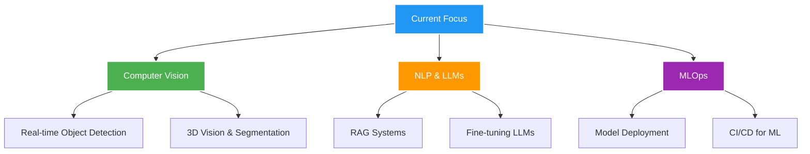

<div align="center">
  
# _Ourara_


</div>

---

## 🧠 About Me

```python
class IlyasOurara:
    def __init__(self):
        self.name = "Ilyas Ourara"
        self.role = "AI Engineer & Computer Vision Specialist"
        self.location = "France 🇫🇷 | Morocco 🇲🇦"
        self.education = "Master 2 Smart IoT + Dual Degree AI"
        self.current_work = "Data Science Intern @ GLANCY 3D"
        
    def get_skills(self):
        return {
            "languages": ["Python", "SQL", "C++", "PHP", "JavaScript"],
            "ai_ml": ["TensorFlow", "PyTorch", "Keras", "Scikit-Learn"],
            "computer_vision": ["OpenCV", "YOLO", "Detectron2", "MediaPipe"],
            "nlp": ["LangChain", "Transformers", "Spacy", "NLTK"],
            "frameworks": ["Streamlit", "FastAPI", "Flask", "Next.js"],
            "cloud": ["AWS", "Google Cloud", "Docker", "Kubernetes"],
            "databases": ["PostgreSQL", "MongoDB", "Redis"],
            "tools": ["Git", "Jupyter", "VS Code", "Postman"]
        }
    
    def current_focus(self):
        return [
            "🔍 Computer Vision for Real-time Applications",
            "🤖 Large Language Models & RAG Systems", 
            "📊 Advanced Data Science Techniques",
            "🚀 MLOps & AI System Deployment"
        ]
    
    def goals_2026(self):
        return "Seeking Final Year Project in AI/Computer Vision (March 2026)"

me = IlyasOurara()
print(f"Hi! I'm {me.name}, {me.role}")
```

---

## 🛠️ Tech Stack & Tools

<div align="center">

### Programming Languages


### AI/ML & Data Science


### Frameworks & Libraries


### Cloud & DevOps


</div>

---

## 📊 GitHub Statistics

<div align="center">
  
  
</div>

<div align="center">
  
  
</div>

---

## 🚀 Featured Projects

<div align="center">

[](https://github.com/YOUR-USERNAME/glancy-3d-volume-estimation)
[](https://github.com/YOUR-USERNAME/watikati-ai-chatbot)

[](https://github.com/YOUR-USERNAME/irmf-brain-imaging)
[](https://github.com/YOUR-USERNAME/arteka-ppe-detection)

</div>

### 🏆 Project Highlights

| Project | Description | Tech Stack | Status |
|---------|-------------|------------|--------|
| 📦 **GLANCY 3D** | AI-powered package volume estimation system | Python, TensorFlow, OpenCV, Streamlit | 🔄 In Progress |
| 🤖 **WatiKati** | Administrative AI chatbot (Hackathon Winner) | Python, Gemini API, RAG, LangChain | ✅ Completed |
| 🧠 **IRMF Brain Imaging** | 3D brain visualization with tumor detection | TensorFlow, Computer Vision, 3D Processing | ✅ Completed |
| 🦺 **Arteka PPE Detection** | Real-time safety equipment monitoring | OpenCV, YOLO, Real-time Processing | ✅ Completed |

---

## 🏆 Achievements & Recognition

<div align="center">

| 🏅 Achievement | 📅 Date | 🏢 Organization |
|----------------|---------|-----------------|
| 🥇 **HACK AI Hackathon Winner** | May 2025 | École 1337 / UM6P |
| 🎓 **Dual Degree Program** | 2024-2026 | France-Morocco |
| 💼 **Data Science Internship** | Sept 2025 | GLANCY 3D |
| 🧠 **AI Specialization** | 2024-2025 | Master Smart IoT |

</div>

---

## 📈 Coding Activity

<div align="center">
  
<!--START_SECTION:waka-->
<!--END_SECTION:waka-->


</div>

---

## 🌱 Current Learning & Goals

<div align="center">



</div>

### 🎯 2026 Goals
- 🔍 **Final Year Project** in AI/Computer Vision (March 2026)
- 📚 **Research Publication** in Computer Vision
- 🚀 **Open Source Contribution** to major ML libraries
- 💼 **Full-time Position** in AI/ML after graduation

---

## 🤝 Let's Connect!

<div align="center">

[](YOUR-LINKEDIN)
[](YOUR-PORTFOLIO)
[](mailto:YOUR-EMAIL)
[](YOUR-TWITTER)

### 💬 Ask me about
**Computer Vision** • **Deep Learning** • **AI Applications** • **Data Science** • **Python Development**

### 📧 Professional Inquiries
🎯 **Available for Final Year Project (PFE)** starting March 2026  
💼 **Open to collaboration** on AI/ML projects  
🌍 **International opportunities** welcomed  

</div>

---

<div align="center">

### 💭 Quote of the Day


### 🎵 Currently Listening to
[](https://open.spotify.com/user/YOUR-SPOTIFY-ID)

### 🔥 Streak Stats


</div>

---

<div align="center">
  
**✨ "Transforming data into intelligent solutions, one algorithm at a time" ✨**


</div>
